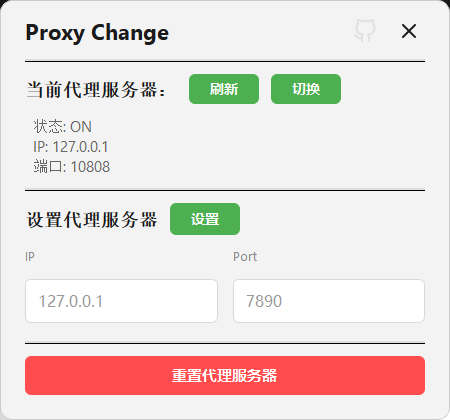

# Proxy Change

基于 PySide6 的 Windows 代理切换工具：一键开关系统代理、设置代理地址与端口，支持系统托盘。

## 效果预览



**功能概览：** 一键开启/关闭系统代理 · 设置代理 IP 与端口 · 系统托盘常驻 · 响应式界面

## 开发与打包流程

### 开发流程

1. **环境准备**（建议 Python 3.10+）

   ```bash
   python -m venv venv
   .\venv\Scripts\activate
   pip install PySide6
   ```

2. **本地运行**

   ```bash
   python main.py
   ```

### 打包流程

必须在**已激活的虚拟环境**中执行，以保证 PySide6 等依赖被正确打进单文件。

1. **安装打包工具**

   ```bash
   .\venv\Scripts\activate
   pip install pyinstaller
   ```

2. **执行打包**

   ```bash
   pyinstaller --noconsole --onefile --add-data "logo.ico;." --add-data "close.svg;." --add-data "github.svg;." --icon="logo.ico" --name "ProxyChange" main.py
   ```

3. **产物位置**

   打包完成后，可执行文件在 `dist/ProxyChange.exe`。

### 使用国内镜像（可选）

若 pip 出现 SSL 或超时，可使用阿里云镜像：

```bash
pip install PySide6 pyinstaller -i http://mirrors.aliyun.com/pypi/simple/ --trusted-host mirrors.aliyun.com
```

### 常见问题

- **Fatal error in launcher / Unable to create process**  
  多为虚拟环境路径变动导致。可改用：  
  `python -m pip install ...`、`python -m PyInstaller ...`  
  或删除 `venv` 后重新 `python -m venv venv` 并重装依赖。

- **CI / GitHub Actions**  
  推送到 `main`/`master` 会在 Actions 中构建并产出 Artifact；**推送 tag（如 `v1.0.0`）** 会自动构建并发布到 [Releases](releases)，可直接下载 `ProxyChange.exe`。

## 许可证

见 [LICENSE](LICENSE)。
